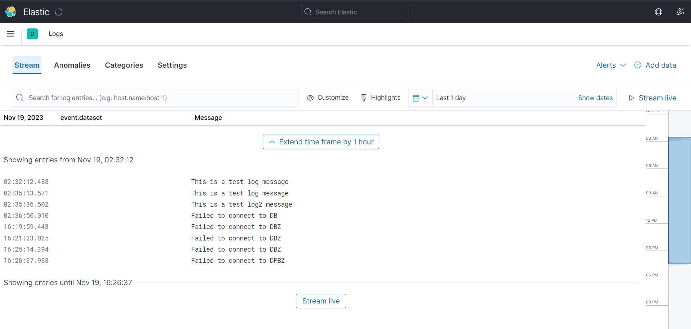
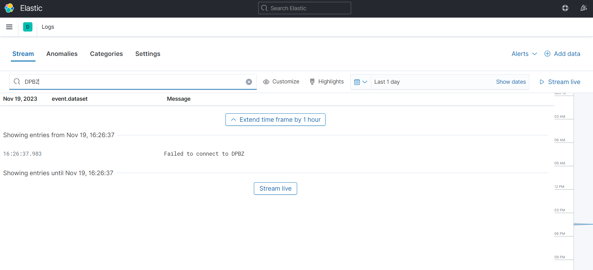
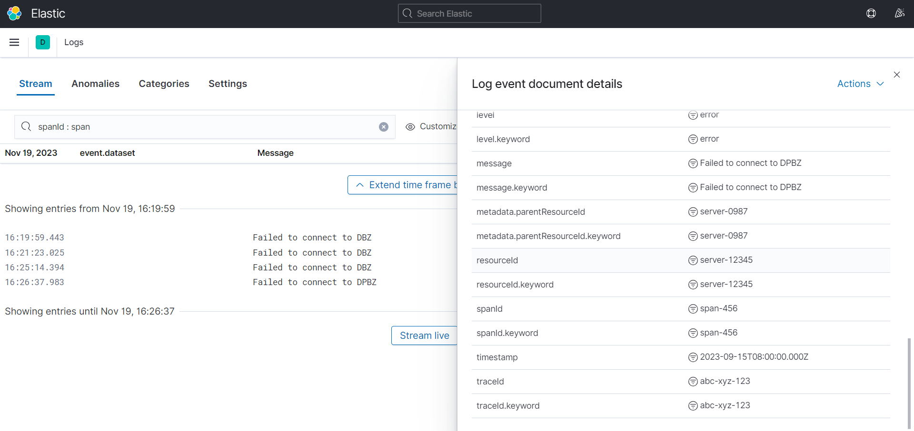
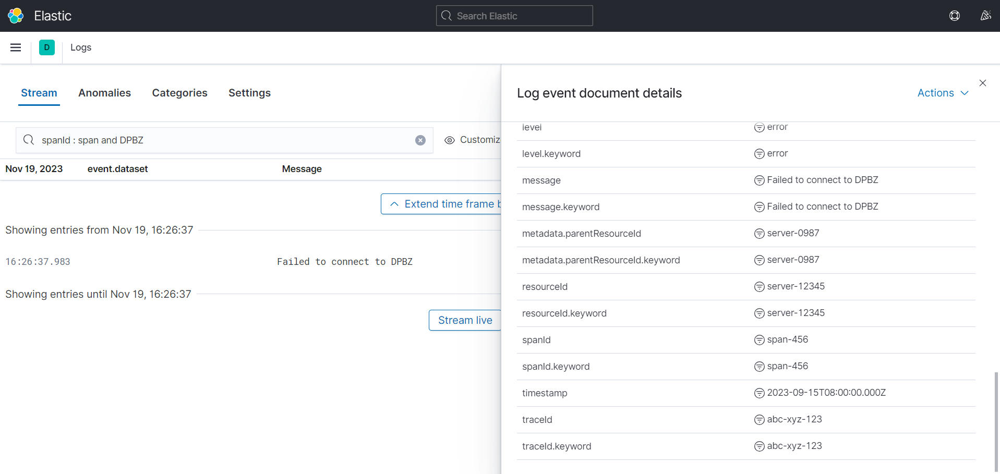

##The Log Injestion Project

This project include the following parts as per request in the assingment documnation

- Ingestion Server That is a node server that listens on Port 3000 for the incoming Logs.
- Then comes the LogStash Container that injests the logs in the given format and passes them to the storages.
- Then for storing the logs we are using ElasticSearch for keeping each log as structured document.
- Then for for Querying UI to query and search specific logs we have Kibana.

Here are Steps for log Ingestion Server to get it start listening for logs:-
    - npm install
    - node app.js
now we have a logIngestionServer that listens on port 3000 for the incoming logs.

For ElasticSeach and Logstash Containers you just need to run the following command:-
    - docker-compose up -d

now logstash is running on http://localhost:5000
elasticsearch on http://localhost:9200
Kibana on http://localhost:5601

For Kibana you need to add the index to settings for logs Indexes which can be found at the following:
    Menu -> Observability -> Logs -> Settings add which ever index you want to add.

Now you can see all the logs stored in the elasticSearch 

as shown below:-

you can perform Full Text Search

you can perform a Filter Query based on any attribute in the log with combinations and also modify date and time ranges

Also you can use ES Apis to verify data as well as follows:-

curl --location 'localhost:9200/test-index/_search?pretty=null&size=100' \
--header 'Content-Type: application/json'

There were lot of scope for improvement like rolebased access, but the major factor was a custom UI although Kibana provides it but 
I could have created Kibana Plugins and used KPL to create a Dashboard but currently i am working on a Windows laptop and the does not 
supports windows and requires WSL hence one major improvement can be done here.

Auhtor : Harsh Vardhan.